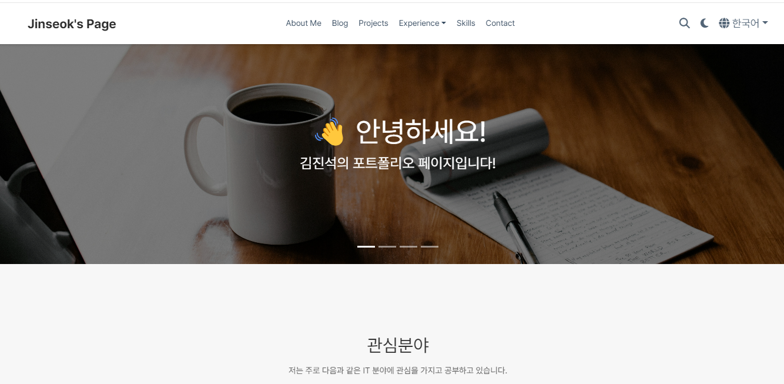
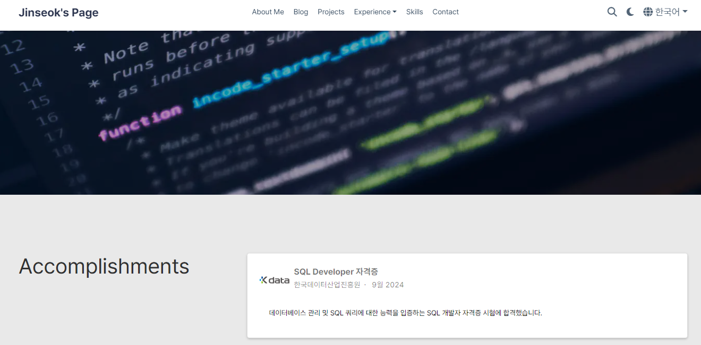
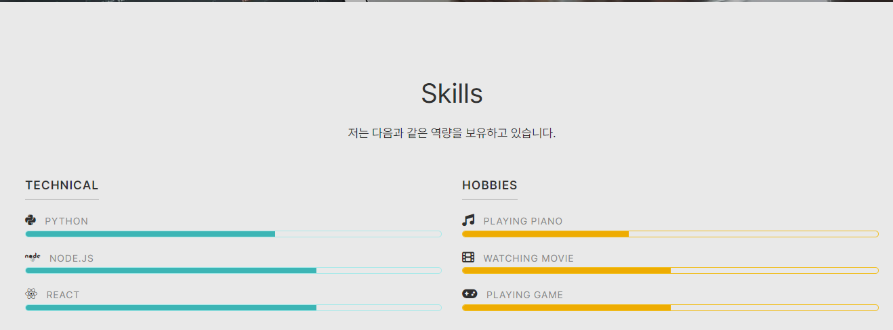

# Jinseok's Page

## 프로젝트 소개

이 웹사이트는 저의 개인 포트폴리오 페이지로, 다양한 프로젝트, 기술 및 경험을 소개합니다. 이 페이지는 사용자가 쉽게 제 경력과 기술 스택을 확인할 수 있도록 설계되었습니다. 각 프로젝트에 대한 설명과 링크가 포함되어 있어 방문자는 직접 프로젝트를 체험하고 더 많은 정보를 얻을 수 있습니다.

또한, 반응형 디자인을 적용하여 다양한 기기에서 최적의 사용자 경험을 제공합니다. SEO 및 OpenGraph를 활용하여 검색 엔진에서의 가시성을 높였으며, 간편한 연락처 폼을 통해 문의할 수 있는 기능도 제공합니다.

이 웹사이트는 저의 기술을 시연하고 다양한 사람들과 소통할 수 있는 플랫폼이 역할이 될 것 입니다.


## 개발 환경 및 기술 스택
- HTML/CSS/JavaScript
- HugoBlox Bootstrap v5
- Markdown
- SCSS
- Github Actions
- Github Pages


## 개발 기간 및 작업 관리
### 개발 기간
전체 개발 기간 : 2024-09-15 ~ 2022-10-06

### 작업 관리
GitHub Projects와 Issues를 사용하여 진행 상황을 기록했습니다.


## 페이지별 구성

### 메인페이지



### 성과 페이지



### 기술스택 페이지



## 설치 방법
레포지토리 클론:
```bash
git clone https://github.com/jinseok1006/jinseok1006.github.io.git
cd jinseok1006.github.io
```

## 배포
레포지토리에 push하면 Github actions에 의해서 github pages로 자동 배포됩니다.
보통은 아래의 경로로 배포됩니다.
```
https://{username}.github.io/wsd-hw1-bootstrap
```


## 라이선스
이 프로젝트는 MIT 라이선스 하에 배포됩니다. 자세한 내용은 LICENSE.md 파일을 참조하세요.

## 연락처
문의 사항이 있으면 언제든지 연락해 주세요!

- 이메일: [jinseok1006@naver.com](mailto:jinseok1006@naver.com)
- GitHub: [github.com/jinseok1006](https://github.com/jinseok1006)

